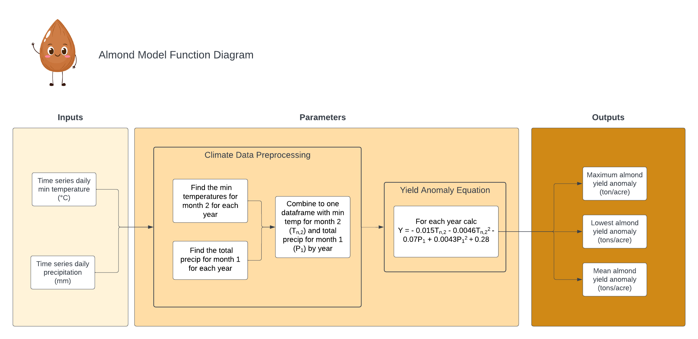

```{r setup, include=FALSE}
knitr::opts_chunk$set(echo = TRUE)

library(tidyverse)
library(purrr)
```

## Conceptual Model



## Application of Function
```{r}
source("calc_almond_yield.R")

calc_almond_yield("clim.txt")
```

## Creating Function Variables/Exploration
The below chunks outline the steps inside the function that we created.
```{r}
#read in climate data
clim_df <- read.table("clim.txt", header = TRUE)
```

### Setting Coefficient defaults 
```{r}
Tmincoeff1 = -0.015
Tmincoeff2 = -0.0046
Pcoeff1 = -0.07
Pcoeff2 = 0.0043
intercept = 0.28
```

### Pre-processing data
```{r}
#Tn2: temp min for each year for February
yearly_tmin_feb <- clim_df |>
  group_by(year, month) |>
  summarize(min_temp_2 = min(tmin_c)) |>
  filter(month == 2) |>
  select(-month)

tlist<- as.list(yearly_tmin_feb)

#P1: precip sum for each year for January
yearly_precip_jan <- clim_df |>
  group_by(year, month) |>
  summarize(precip_sum_1 = sum(precip)) |>
  filter(month == 1) |>
  select(-month)

plist <- as.list(yearly_precip_jan)

tmin_precip_df <- left_join(yearly_tmin_feb, yearly_precip_jan)
```

### Calculate anomaly values
```{r}
anomaly_value <- Tmincoeff1 * tmin_precip_df$min_temp_2 + Tmincoeff2 * (tmin_precip_df$min_temp_2**2) + Pcoeff1 * tmin_precip_df$precip_sum_1 + Pcoeff2 * (tmin_precip_df$precip_sum_1**2) + intercept

#add anomaly values to tmin_precip_df
yield_df <- tmin_precip_df |>
  cbind(anomaly_value = anomaly_value) 
```

### Results
```{r}
#minimum value in the vect
min_val <- min(yield_df$anomaly_value)

#maximum value in the vect
max_val <- max(yield_df$anomaly_value)

#mean value in the vect
mean_val <- mean(yield_df$anomaly_value)

results_df <- data.frame(min_val, max_val, mean_val)
```

