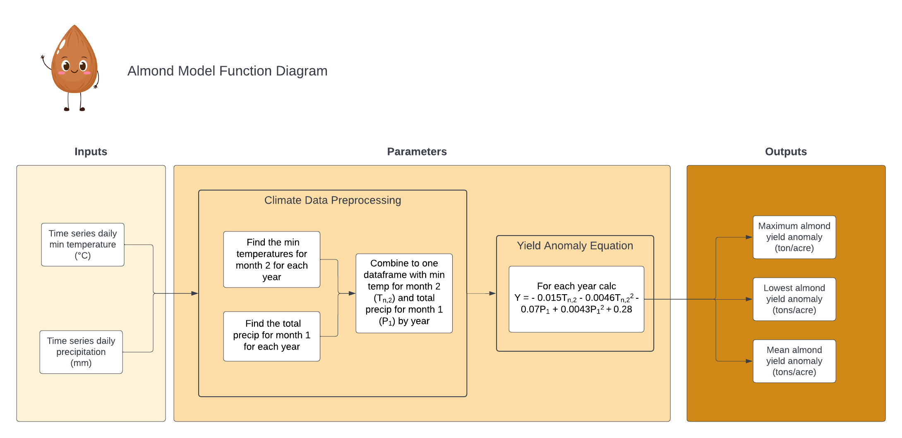

```{r setup, include=FALSE}
knitr::opts_chunk$set(echo = TRUE)

library(tidyverse)
library(purrr)
library(ggpubr)
```

## Conceptual Model including profit



## Application of Function
```{r}
source("calc_almond_yield.R")
source("calc_profit.R")
source("calc_NPV.R")

yield <- calc_almond_yield("clim.txt")
profit <- calc_profit(calc_almond_yield_results = yield)
```

#Exploration
```{r}
# market_price = 5000
# discount=0.12
# area = 10
# baseline_profit = market_price * area
# 
#   yield_df$anomaly_profit = anomaly_value * market_price * area #returns dollars
#   yield_df$total_profit = yield_df$anomaly_profit + baseline_profit
```

#Informal Sensitivity Analysis
```{r}
# generate samples for both parameters
nsamples = 300
deviation = 0.15
base_price = 5000
market_price = runif(min=base_price-deviation*base_price,
                max = base_price+deviation*base_price, n=nsamples)

discount = rnorm(mean=0.12, sd = 0.1, n=nsamples)

parms = cbind.data.frame(discount, market_price)

# takes function name and then names of all parameters that don't change
results = parms %>% pmap(calc_profit, calc_almond_yield_results = yield)

# now we can extract results from the list as above
mean_adjusted_profit = map_df(results,`[`, c("mean")) 
# and we can add the parameter values for each run
mean_adjusted_profit = cbind.data.frame(mean_adjusted_profit, parms)

# plot - pick on of the 2 parameter as a color

p1 = ggplot(mean_adjusted_profit, aes(market_price, mean, col=discount))+geom_point(cex=2)+
  labs(y="Mean Annual Adjusted Profit ($)", x="Market Price ($/ton)")
p2 = ggplot(mean_adjusted_profit, aes(discount, mean, col=market_price))+geom_point(cex=2)+
  labs(y="Mean Annual Adjusted Profit ($)", x="Discount")
ggarrange(p1,p2)
```

**When comparing the two parameters (market price and discount), discount rate has more of an effect on mean annual profit.**


